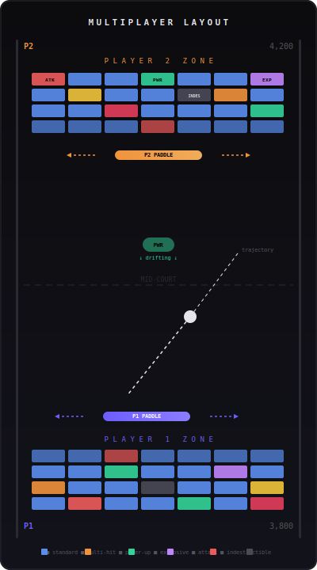
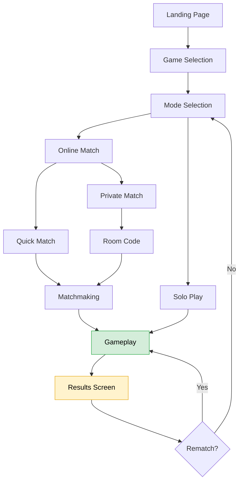
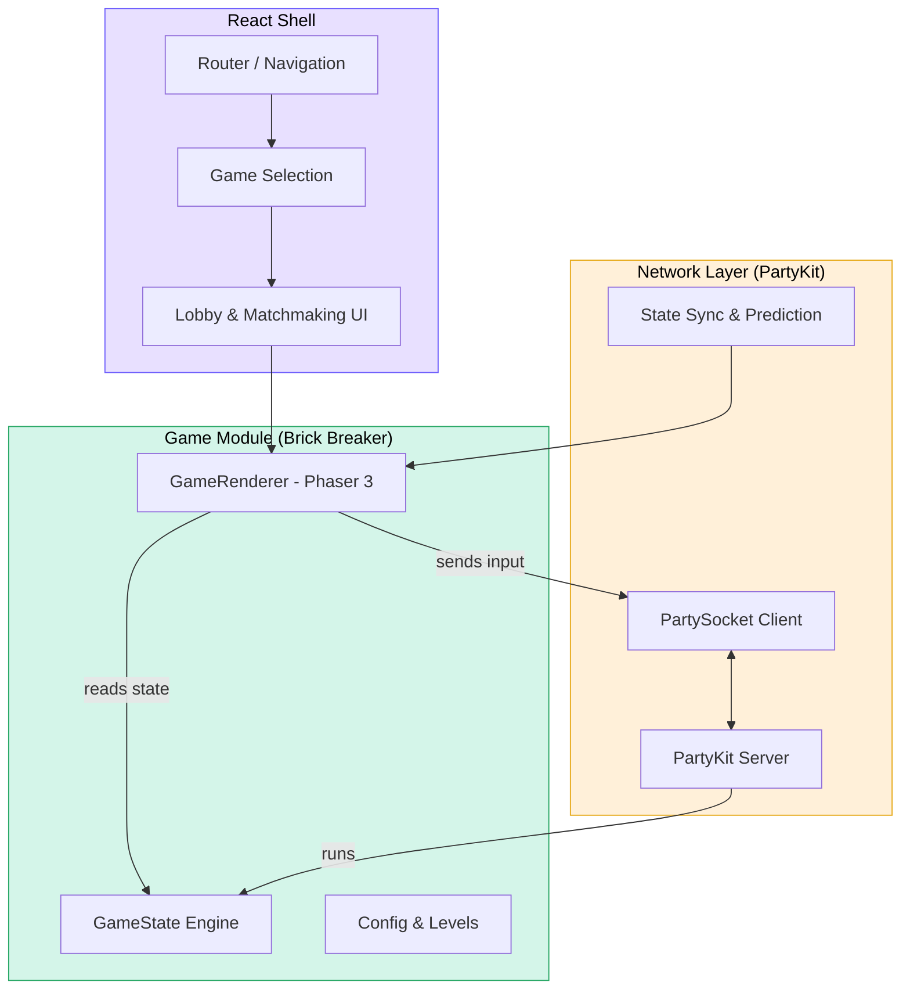
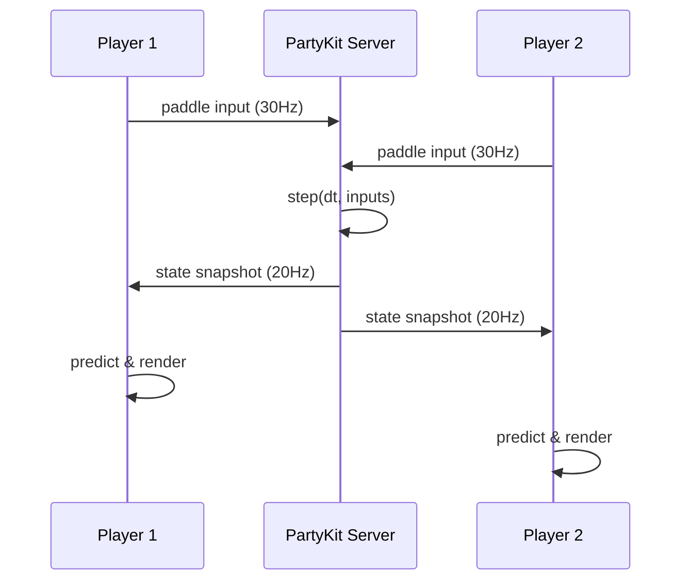
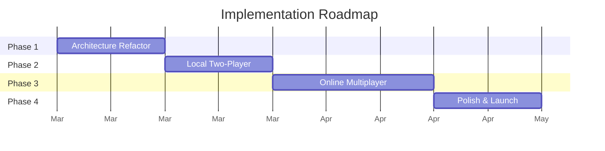

# Brick Breaker — Multiplayer Edition PRD

> **Version 1.0 · Draft · February 2026**
>
> Extends the existing single-player Brick Breaker into a competitive online multiplayer platform, architected to support additional retro games in the future. Mobile-first, playable as a PWA.

---

## Game Concept

**Pong × Breakout.** Two players, two paddles, two brick walls. You defend your bricks while trying to destroy the opponent's. First to clear the other side wins.

The portrait layout is optimised for phones. Player 1 is at the bottom, Player 2 at the top. Each player's bricks sit between their paddle and the screen edge. The ball bounces between the two halves.

<p align="center">
  
</p>

---

## Core Rules

**Win condition:** Destroy all of the opponent's bricks. Matches are best-of-3 (default) or best-of-5.

**Ball mechanics:**
- Single ball launches from center toward a random player at round start.
- Bounces off paddles, bricks, and side walls. Does *not* bounce off the edges behind paddles.
- On a miss, ball resets to center and launches toward the player who missed.
- Paddle contact angle determines trajectory — edge hits create sharper angles for skilled aiming.

**Round system:** Each round has a different brick layout, escalating in complexity:

| Round | Layout |
|-------|--------|
| 1 | Symmetric, simple. Introduction to the mechanic. |
| 2 | Asymmetric with multi-hit and indestructible bricks. |
| 3+ | Attack bricks, complex patterns, more power-ups. |

Rounds create natural break points — important for mobile where players get interrupted.

---

## Brick Types

All existing single-player brick types carry over, plus a new **Attack** type:

| Type | Behaviour | Hits |
|------|-----------|------|
| Standard | Destroyed in one hit | 1 |
| Multi-hit | Changes colour as damaged | 2–3 |
| Indestructible | Obstacle, cannot be destroyed | — |
| Power-up | Drops a collectible power-up | 1 |
| Explosive | Destroys adjacent bricks | 1 |
| **Attack** *(new)* | **Sends a penalty to the opponent** | 1 |

**Attack brick penalties** (one is chosen when the brick is destroyed):
- Spawn an extra row of bricks on the opponent's side
- Temporarily widen the ball's hitbox (harder for opponent to aim)
- Briefly invert opponent's paddle controls

Attack bricks create risk/reward decisions: go for easy bricks, or aim for the harder-to-reach attack brick?

---

## Power-Ups

When a power-up brick breaks, the item drifts toward mid-court. Either player can grab it with their paddle.

| Power-up | Effect | Duration |
|----------|--------|----------|
| Paddle Shrink | Opponent's paddle shrinks 30% | 10s |
| Speed Boost | Ball speeds up on opponent's side | 8s |
| Multi-ball | Ball splits into 3 | Until lost |
| Shield Row | Temporary shield bricks in front of your wall | 15s |
| Curve Ball | Ball curves toward opponent's bricks | 3 hits |

---

## Screen Flow



**Landing Page:** Branding + quick-play for returning users.
**Game Selection:** Grid of games (initially just Brick Breaker, designed for more).
**Mode Selection:** Solo or Online, with brief descriptions.
**Lobby:** Quick Match (searching + cancel) or Private Match (4-char room code).
**Results:** Score breakdown by round, rematch option.

---

## Architecture

The key architectural change is separating game logic from rendering, and wrapping everything in a platform shell that supports multiple games.



### State Engine Separation

This is the most important refactor. The current `PlayScene.ts` (~700 lines) mixes game logic with Phaser rendering. We split it into:

**GameState** (pure TypeScript, no Phaser imports):
- Ball position/velocity, paddle positions, brick grid, scores, power-up timers, round state
- Single `step(deltaTime, inputs)` function drives all mutations
- Runs on both client (prediction) and server (authoritative)

**GameRenderer** (Phaser):
- Reads GameState each frame, updates sprites/visuals
- Handles animations, particles, sound
- Forwards user input to the state engine

This separation lets the server run the same GameState for online multiplayer while clients render locally with prediction.

### Game Module Interface

Each game (Brick Breaker now, others later) implements:

```typescript
interface GameModule {
  id: string;
  name: string;
  modes: GameMode[];          // solo, local-2p, online
  createState(config): GameState;
  createRenderer(canvas, state): GameRenderer;
  destroy(): void;
}
```

---

## Online Multiplayer

### Why PartyKit

[PartyKit](https://docs.partykit.io/) is an open-source platform (now part of Cloudflare) purpose-built for multiplayer and real-time applications. It runs on Cloudflare's edge network, meaning game rooms spin up close to players with low latency worldwide.

What makes it a good fit for this project:

- **Rooms are a first-class concept.** Each match is a PartyKit "party" identified by a room ID. Creating a new match is as simple as connecting to a new ID — no manual server provisioning.
- **Minimal server code.** A game server is a single TypeScript class with `onConnect`, `onMessage`, and `onClose` handlers. Our `GameState.step()` function runs inside this class. That's it.
- **Deploys from the repo in one command.** `npx partykit deploy` pushes the server to Cloudflare's edge. No Docker, no infra config, no CI pipeline required (though you can add one).
- **Free tier is generous.** Sufficient for development and early launch traffic. Usage-based pricing after that — you only pay when people are actually playing.
- **Pairs with Cloudflare Pages.** The frontend deploys to Cloudflare Pages (also free, also from GitHub). Everything lives in one ecosystem with automatic builds on push.

A minimal game server looks like this:

```typescript
import type * as Party from "partykit/server";

export default class GameRoom implements Party.Server {
  state: GameState;

  onConnect(conn: Party.Connection) {
    // Player joined — assign to side, send initial state
  }

  onMessage(message: string, sender: Party.Connection) {
    // Receive paddle input, feed into state engine
    const input = JSON.parse(message);
    this.state.applyInput(sender.id, input);
  }

  onClose(conn: Party.Connection) {
    // Player disconnected — pause or end match
  }
}
```

The client connects with a single line using the `partysocket` npm package:

```typescript
import PartySocket from "partysocket";

const socket = new PartySocket({
  host: "your-project.username.partykit.dev",
  room: "match-ABC1",
});
```

### Networking Model

Authoritative server — the server's GameState is truth:



- Clients send paddle position at 30Hz
- Server broadcasts state at 20Hz
- Client-side prediction for paddle (immediate), interpolation for ball/bricks (smooth)
- Playable up to ~150ms RTT; warn above 200ms

### Matchmaking

**Quick Match:** Tap play, matched with first available opponent. Target <15s wait.
**Private Match:** Create room → get 4-char code → share with friend. Expires after 5 min.

### Disconnection

- Pause 15s on disconnect, attempt reconnection
- If reconnection fails, remaining player wins
- Brief disconnects (<2s) masked by showing last known paddle position

---

## Mobile & PWA

**Touch controls:** Horizontal drag anywhere in your half of the screen moves your paddle. No need to touch the paddle directly — much more forgiving on small screens.

**Layout:** Portrait-first (360–430px width). Canvas scales to fill viewport. UI elements (score, round, power-up indicators) must not overlap the play area. Desktop uses the same portrait layout, centred, with keyboard controls available.

**PWA checklist:**
- Web app manifest (name, icons, theme colour)
- Service worker for offline single-player
- Clear "offline" indicator when multiplayer unavailable
- Target Lighthouse PWA score: 90+
- Haptic feedback on ball-paddle contact (where supported)

**Performance targets:**
- 60fps on mid-range phones (2022+)
- Initial load <3s on 4G
- Asset bundle <500KB gzipped

---

## Implementation Phases

Each phase produces a working, deployable app.



### Phase 1 — Architecture Refactor
Extract GameState from PlayScene. Build React navigation shell. Single-player works identically after this.

**Delivers:** GameState class with `step()`, GameRenderer class, React router with game/mode selection, all existing tests passing.

### Phase 2 — Local Two-Player
Dual-paddle mode on a single device (split touch zones). Proves the multiplayer mechanic without networking.

**Delivers:** Dual-paddle layout, split-screen touch, round system (best-of-N), brick layouts for rounds 1–3.

### Phase 3 — Online Multiplayer
PartyKit game server, matchmaking, and network state sync.

**Delivers:** PartyKit server running authoritative GameState, Quick Match + Private Match (room codes), client-side prediction/interpolation, disconnect handling.

### Phase 4 — Polish & Launch
Power-ups, attack bricks, PWA setup, mobile optimisation.

**Delivers:** Full power-up system, attack bricks, PWA manifest + service worker, haptic feedback, sound, 60fps on mid-range Android.

---

## Tech Stack

| Component | Technology |
|-----------|-----------|
| Language | TypeScript (strict) |
| Game engine | Phaser 3 (rendering only) |
| UI | React 18+ |
| Build | Vite |
| Server | [PartyKit](https://docs.partykit.io/) (Cloudflare) |
| Transport | WebSocket (managed by PartyKit) |
| Frontend hosting | Cloudflare Pages |
| LLM | HuggingFace Inference API (existing) |

---

## Existing Features Preserved

All current single-player functionality continues to work after refactor:
all 5 built-in levels, LLM-generated levels, chat panel (config parsing, level gen, flavour text, narrator), visual theme, power-ups, combos, high scores, and all existing unit tests.

---

## Open Questions

1. **Audio:** Separate music/SFX for multiplayer? What's the audio budget?
2. **Analytics:** Basic match analytics (games played, duration, completion rate)? What tooling?
3. **Abuse prevention:** Rate-limiting or penalties for match abandonment at public launch?
4. **Future games:** Candidate list for additional retro games? Affects how generic the shell needs to be.